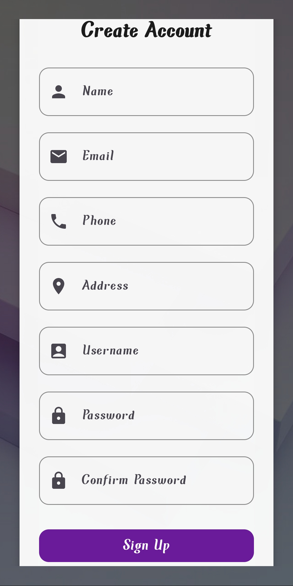
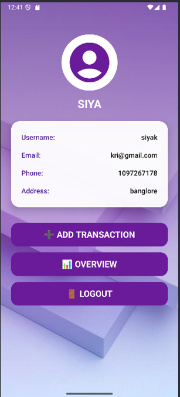
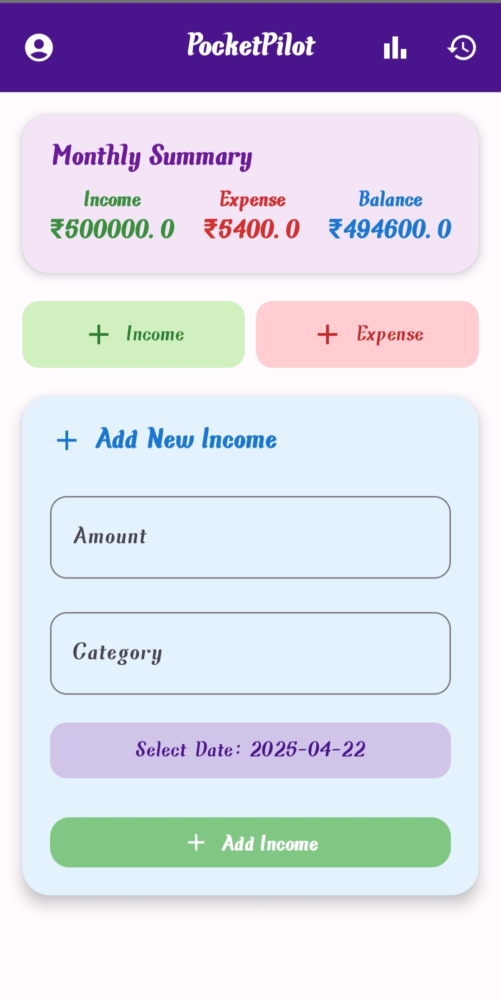
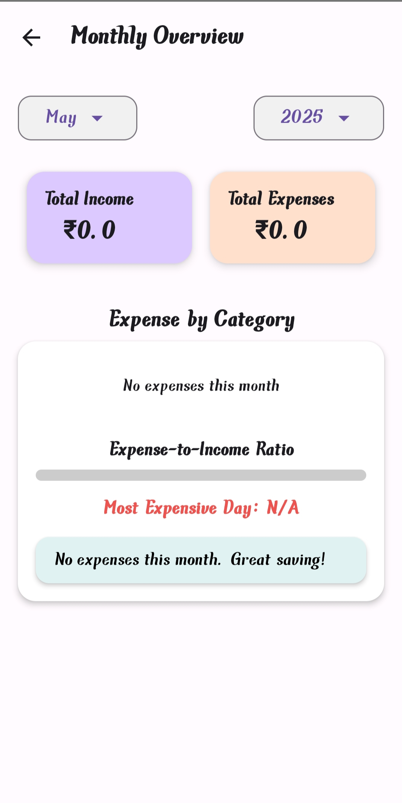
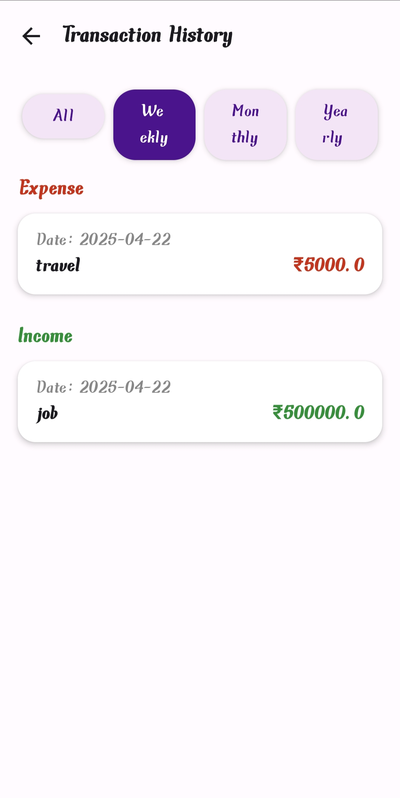
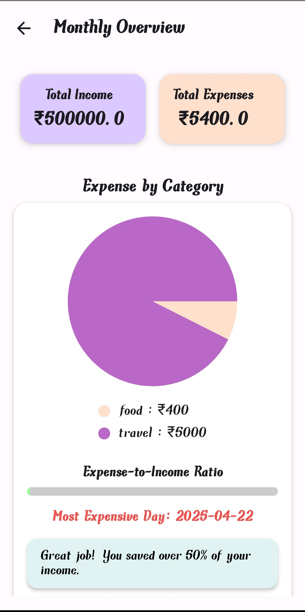

# PocketPilot – Offline Finance App

PocketPilot is a personal finance tracking app built with **Kotlin**, **Jetpack Compose**, and **SQLite**. It works fully offline and helps users manage income and expenses through a modern UI and smart insights.

## Features
- Track income and expenses
- Monthly & weekly summaries
- Bar and pie charts
- Smart spending tips
- Expense-to-income ratio
- Filterable transaction history

## Tech Used
- Kotlin
- Jetpack Compose
- SQLite
- Canvas (for charts)
- MVVM architecture

## How to Run
1. Clone the repo  
2. Open in Android Studio  
3. Run on emulator or device

<h2>Screenshots</h2>

